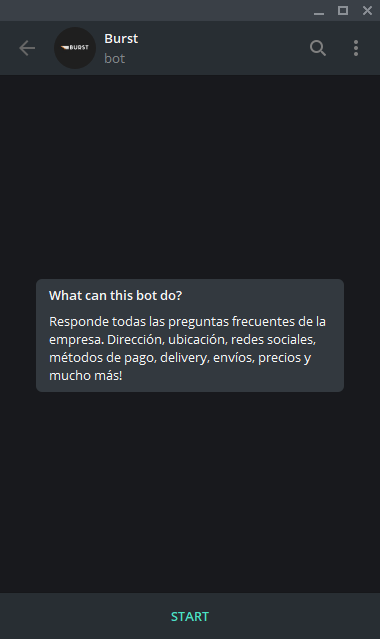
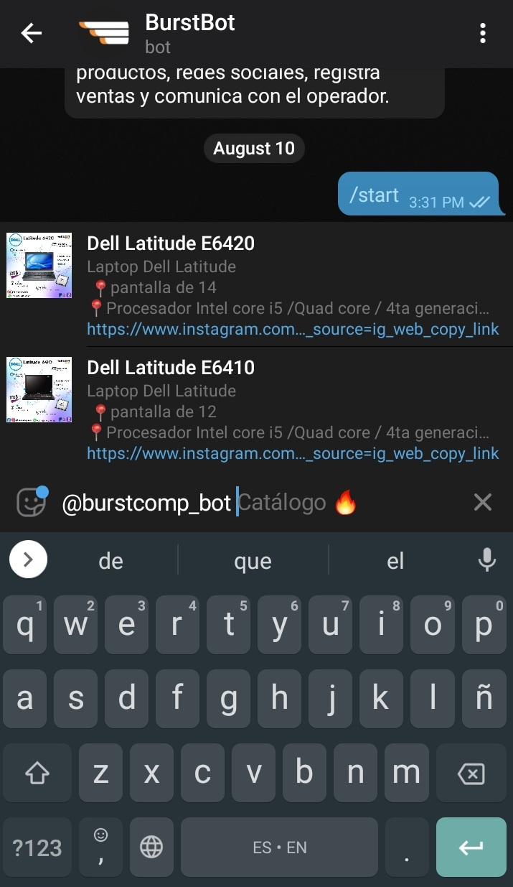

# BurstBot Telegram
Bot de Telegram para Burst Computers

## Comenzando 🚀

Enlace directo al [Bot oficial](https://telegram.me/burstcomputers_bot)


### ¿Que hace el bot? 📋
Las principales funcionalidades son:

* Saludar a nuevos usuarios.
* Responde las preguntas frecuentes referentes a información de la empresa a través de menús interactivos.
* Inline Query: Escribe el ususario del bot desde **cualquier chat** y podrás ver el catálogo de productos
* De acuerdo a la pregunta, envía información en formatos de:
    * Texto
    * Imagenes
    * Embeds
    * Archivos
    * Links
* Escucha comandos:
    * Responde a palabras clave dentro de la conversación que no responden a un formato de comando
* Integrarse con redes sociales a través de webhooks


### Comunicarse con el bot 
Una vez dentro del chat, se debe presionar el botón **Start**
ésto enviará al bot el comando:

```
/Start
```
Ejemplo: 



El bot responderá con un saludo y a continuación enviará el menú principal:

Ejemplo:


A partir de éste punto, la interacción con el bot corresponde al usuario quién puede seleccionar las diferentes opciones para encontrar la información que desea.


Puedes enviar productos del catálogo fácilmente a cualquier usuario a través del Inline Query:

Ejemplo:



## Construido con 🛠️

* [Node.JS](https://nodejs.org/en/) - Entorno que ejecuta codigo _server-side_ Javascript.
* [Telegraf.JS](https://telegraf.js.org/) - Módulo de Node que facilita la interacción con la API de Telegram a través de un ambiente de programación orientado a objetos 
* [Telegraf inline menu](https://github.com/EdJoPaTo/telegraf-inline-menu) - Librería que facilita la creación de menús interactivos


### Deployment 📦

```
-Cuenta verificada en Heroku
```


## Versionado 📌

Usamos [GitHub](https://github.com/) para el versionado y [Heroku](https://www.heroku.com/) para el deployment de la aplicación.

## Autores ✒️


[Andrew Clark](https://github.com/andrewxxclark) - desarrollo oficial para  *Burst Computers* 
